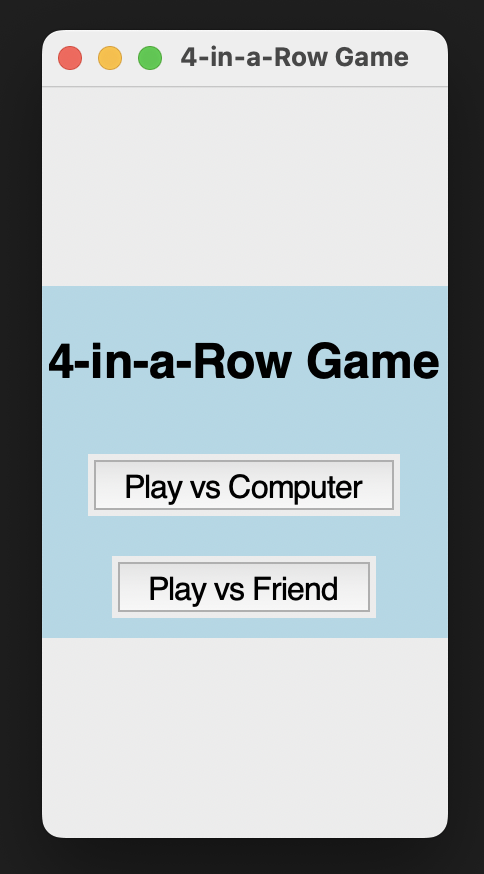
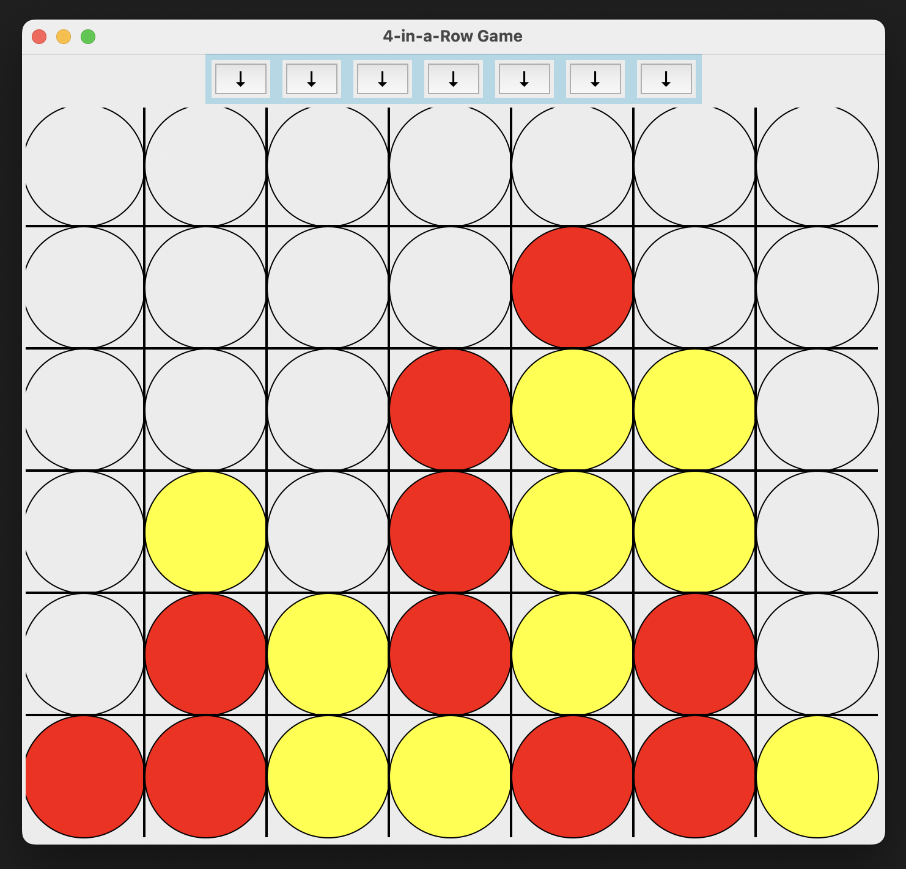
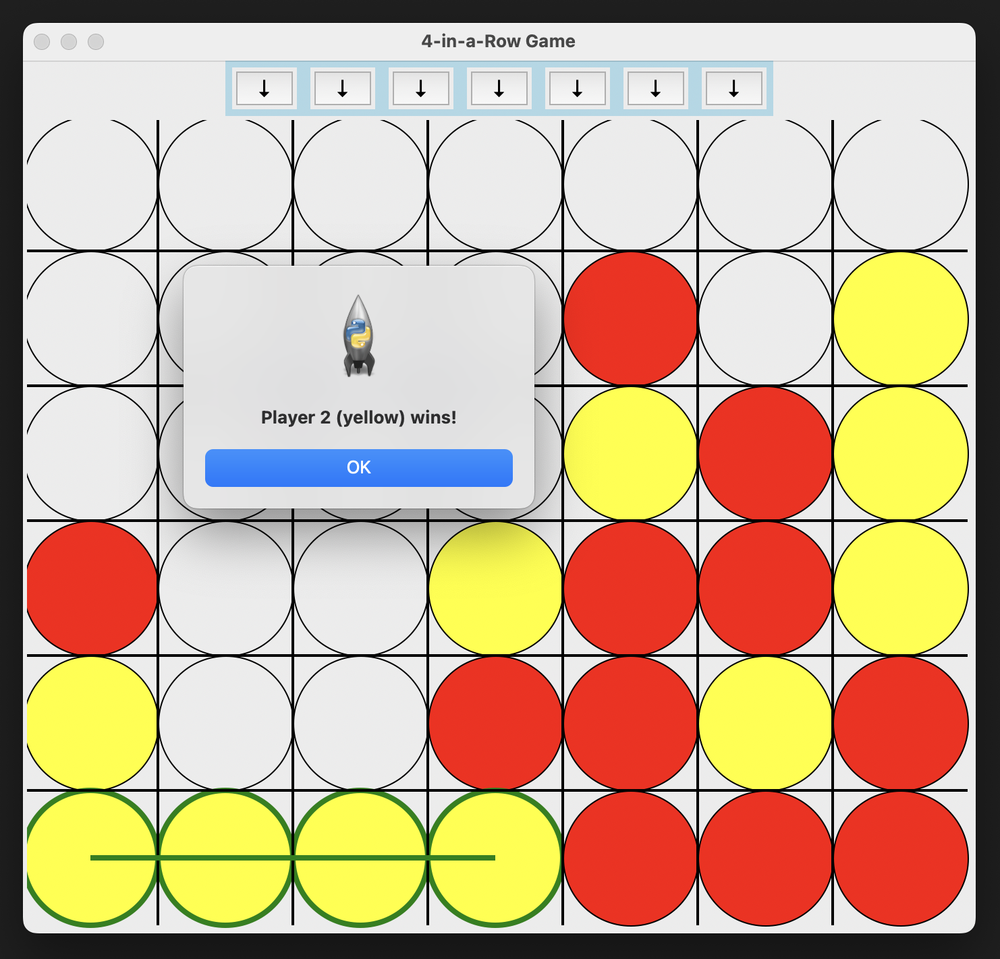
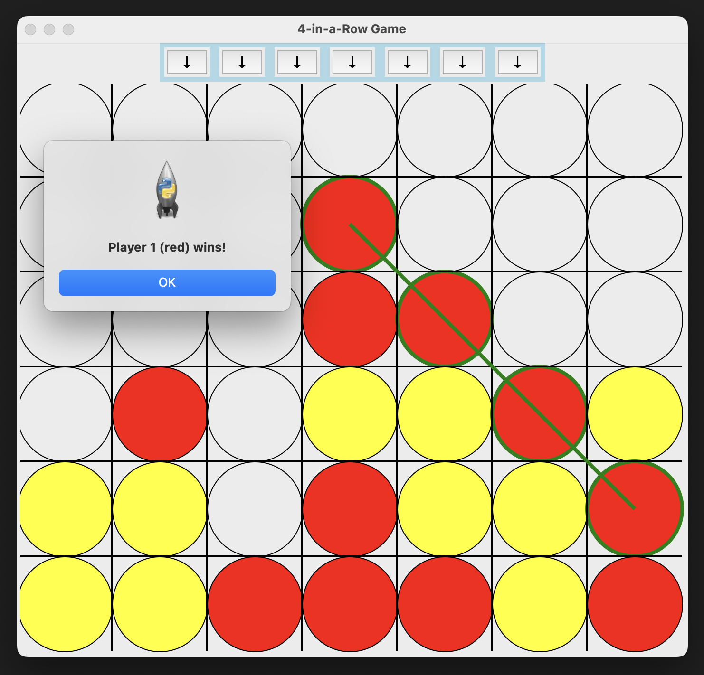

# 4-in-a-Row-Game

In developing the 4-in-a-Row game, I utilized Python's Tkinter library for the graphical user interface (GUI) and NumPy for managing the game's logic. The project involved creating a menu interface for selecting between two-player mode or playing against a computer. Tkinter's widgets were used to design a user-friendly interface, with event handling for player interactions.

The game's core logic was implemented using a 2D NumPy array to represent the board, with functions to handle valid moves and check for win conditions. The upside-down gravity mechanic added a unique challenge, requiring careful adjustment of the usual game logic. This project effectively combined GUI development with complex game logistics, providing a practical application of Python's capabilities.

<table style="border-collapse: separate; border-spacing: 20px;">
    <tr>
        <td></td>
        <td></td>
    </tr>
    <tr>
        <td></td>
        <td></td>
    </tr>
</table>
